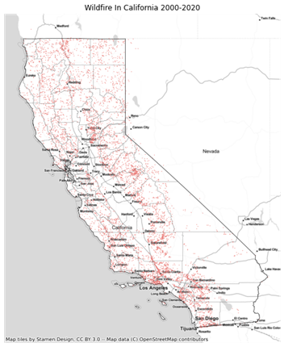
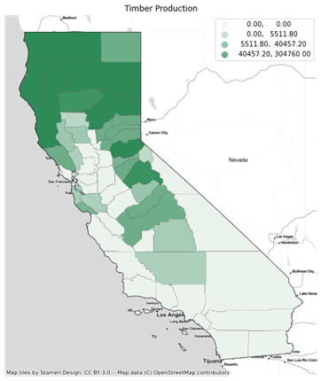
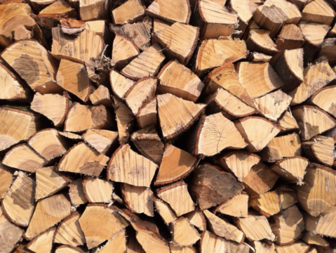
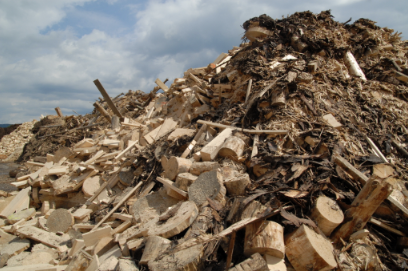

# Can innovative wood use reduce wildfire hazards in California?

## HOME 

### Introduction

Wildfires across western North America have increased in number and size over the past three decades, and this trend will continue in response to further warming. As a consequence, the wildland–urban interface is projected to experience substantially higher risk of climate-driven fires in the coming decades. Although many plants, animals, and ecosystem services benefit from fire, it is unknown how ecosystems will respond to increased burning and warming. Policy and management have focused primarily on specified resilience approaches aimed at resistance to wildfire and restoration of areas burned by wildfire through fire suppression and fuels management. These strategies are inadequate to address a new era of western wildfires. In contrast, policies that promote adaptive resilience to wildfire, by which people and ecosystems adjust and reorganize in response to changing fire regimes to reduce future vulnerability, are needed.

### Our intention
Natural carbon sinks can help mitigate climate change, but climate risks—like increased wildfire—threaten forests’ capacity to store carbon. California has recently set ambitious forest management goals to reduce these risks. However, management can incur carbon losses because wood residues are often burnt or left to decay. This study applies a systems approach to assess climate change mitigation potential and wildfire outcomes across forest management scenarios and several wood products. Innovative use of wood residues supports extensive wildfire hazard reduction and maximizes carbon benefits. Long-lived products that displace carbon-intensive alternatives have the greatest benefits, including wood building products. Our results suggest a low-cost pathway to reduce carbon emissions and support climate adaptation in temperate forests. 

### Research framework
- What caused the wildfire in California?
- How wildfire related to forest management?
- How to better use wood residues to reduce wildfire hazard?

## BACKGROUND 
### Conclusion of background
1-Natural carbon sinks can help buffer climate change, but climatic hazards, like increasing wildfire, put forests' ability to store carbon in jeopardy.  
2-Management can incur carbon losses because wood residues are often burnt or left to decay.  
3-Can innovative use of wood residues support extensive wildfire hazard reduction and maximizes carbon benefits?

### Wildfire incidents
In February 2022 researchers described the drought in the southwest of the USA, including California, in the years 2000 - 2021 as the most severe in 1,200 years. Because of further global warming, it is projected that there will be an increase in risk due to climate-driven wildfires in the coming decades. Because of warming, frequent droughts, and the legacy of past land management and expansion of residential areas, both people and the ecology are more vulnerable to wildfires.

The graph is generated from California wildfire dataset with each point representing one incident. As you can see, wildfire happened on the north more evenly distributed while incidents in the south is much more concentrated to the shore.

## Figure

The graph displayed the comparison between the average acres covered by each incident of a year and the total amount of incidents each year. In the recent five years, the data had fluctuated more significantly which indicates that wildfire is happening more frequently and expanding to larger area.

  
  
  
## CAUSE OF WILDFIRE
### Overall
California’s dry climate provides prime conditions for a wildfire, and unfortunately, it doesn’t take much to spark a fire that can devastate an entire area.

                            

                    

This pie chart shows every detail reasons that spark a wildfire since it was recorded, including some unknown reasons. To take a clearer look at that information, we did analysis the data based on category. 

##figure

                            

                    

After categorizing the fires according to natural and non-natural factors, we found that human factors caused half of the fires. And natural factors and unknown factors each accounted for a quarter. We analyze and discuss the human and natural factors separately as follows.

### Human factors
Wildland fires are classified as either naturally occurring or human-caused. According to the National Park Service, however, human-caused wildfires are significantly more common, with human involvement triggering 85% to 90% of wildfires.  
For any fire to occur, there are three elements needed—heat, fuel, and oxygen:  
**Heat.**There are many potential heat sources that can create embers and ignite wildfires. Many of these are human caused, which we will cover in more detail below.  
**Fuel.**California’s arid climate and abundant, bone dry vegetation provides copious amounts of fuel for wildfires.  
**Oxygen.**California’s infamous Santa Ana winds, dubbed “Diablo winds” by some locals, produce gusts averaging 45-50 mph, with record gusts clocked at over 160 mph. These winds fan the flames and spread embers, leading to truly devastating wildfires.

California’s dry climate, abundant winds, and dried vegetation provide prime conditions for a wildfire—and it only takes a single ember to ignite and destroy hundreds of thousands of acres. Here’s a closer look at the top three heat sources that are the most common cause of wildfires:
- **Burning Debris**  
Escaped embers from burning debris is one of the most common causes of wildfires. On a particularly windy day, escaped embers can carry for miles without extinguishing.
In many parts of the United States, burning dead vegetation is illegal. However, in some states, such as California, it is permitted during certain times of the year. When burning vegetation and other debris, stay mindful and pay close attention to weather conditions. 
- **Unattended Campfires**  
We typically associate campfires with beautiful memories, like s’mores and stories with loved ones. However, despite a campfire’s summertime appeal, they are one of the leading causes of wildfires. The Ham Lake Fire, which destroyed 75,000 acres and hundreds of properties, is just one example of the devastation that a single campfire can cause. If you plan on camping this year, always remember to practice proper fire safety. 
- **Electrical Power**  
Fallen power lines rank among the top causes of wildfires, ranking as the third most common cause of wildfires in California. In some cases, it only takes a branch falling from a tree and striking a power line to create sparks. Nearly 10% of wildfires result from fallen power lines, which equates to roughly 400 fires per year in California.  
  
  
### Natural factors
California covers about 100 million acres and approximately 40 percent of the state is forest.

Forest operations such as logging, thinning, and ecosystem restoration create a huge amount of woody biomass. When residues from timber harvests are left scattered throughout the forest, they act as additional dry surface fuel and serve to increase intensity and severity of a wildfire.  
Due to human fire suppression methods in the past century, there is a build of fuels and wood residues in some ecosystems, making them more vulnerable to wildfires. There is greater risk of fires occurring in denser, dryer forests.

                            

                    

                            

                    

Recent years, due to covid and trade war, the lumber market is not stable, and the wood production does not have a strong correlation with the market price of timber. So, we question if the wood products are fitting to the demands of the market. We start to look at the new and more effective wood production trends.

## INNOVATIVE USE
### What are Wood Residues?
Wood residues mean, in reference to logging, manufacturing, or milling processes, woody waste that is generated by the cutting, chipping, grinding, shaping, or smoothing of wood or its products. They mostly can be reused or recycled.  

        

People usually use them in two ways: one is to use them as basic fuel purposes in manufacturing facilities (to produce energy through the burning of this waste), the other is to use as sources of biomass.

### Why Wood Residues?
This is a graph showing the comparison among farming lumber (whether made of wood residues or new wood). It shows that the lumber is produce much less carbon emissions than most of other materials.

                            

                    

As a result, the quantity of greenhouse gases emission is lower, the wood materials and its production can store carbon in longer periods. Also, less carbon emissions will be given out since the fuels that used to produce wood production is much less than used to produce other materials.

### Carbon Benefit
For forest residue products, carbon benefits vary widely.

                            

                    

Biopower, currently the most common use of forest residues in California, has a low carbon benefit (0.11 tC/tC) relative to more innovative technologies, primarily because of the absence of CO2 storage and the displacement of relatively clean electricity. Conversely, technologies with a large fraction of carbon storage have the greatest benefits. Biopower with carbon capture and storage (CCS) has a comparatively high carbon benefit (0.81 tC/tC), because a large portion of the emitted CO2 is captured and stored. Hydrogen with CCS, glue-laminated timber (GluLam), and OSB have the highest carbon benefits (1.18 to 1.65 tC/tC) of any of the studied products because of both high substitution benefits and carbon storage in wood products or via CCS.

# Header 1
## Header 2
### Header 3

